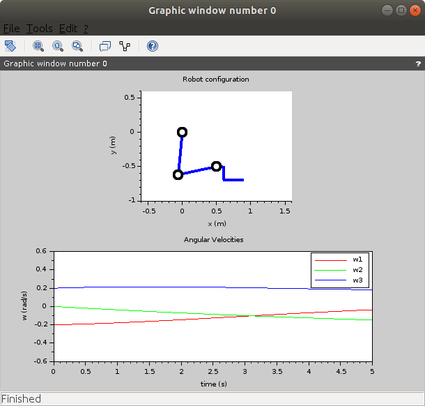

# kinematics3r
Final project for Kinematics course of UVic 2019-2020.
To run the program, open the file project.sce in SciLab or just change to the directory and run:

 ```exec('project.sce')```

On the first lines of this file, you can see the value of the different parameters used for the simulation.


